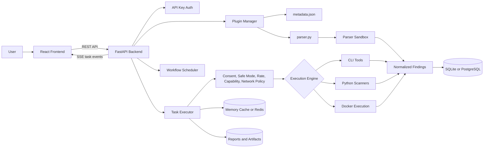
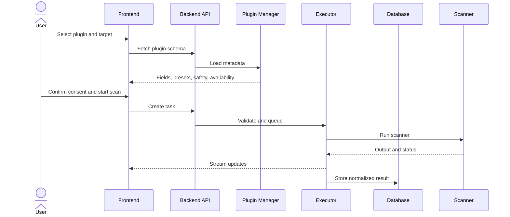

<p align="center">
  
</p>

<h1 align="center">SecuScan</h1>

<p align="center">
  <strong>Local-first security scanning workspace for authorized testing, learning, and extensible automation.</strong>
</p>

<p align="center">
  <a href="LICENSE"></a>
  <a href="https://www.python.org/"></a>
  <a href="frontend/"></a>
  <a href="PLUGINS.md"></a>
</p>

> **Authorized use only:** Run SecuScan only against systems you own, systems you are explicitly permitted to assess, or deliberately vulnerable lab environments.

## Overview

SecuScan is an open-source workspace for running and organizing authorized security scans. It combines a React frontend, a FastAPI backend, a metadata-driven plugin system, workflow automation, normalized findings, reports, and safety controls.

It is useful for students, contributors, security learners, and practitioners who want one local place to configure scanners, run tasks, review output, and build new integrations. It is not a replacement for professional manual testing or a full penetration-testing distribution.

## At a Glance

- Local-first app with local scan history, reports, logs, and runtime data.
- React + TypeScript frontend with plugin-driven forms.
- FastAPI backend with API-key authentication and OpenAPI docs.
- 60 catalogued plugin integrations from `plugins/*/metadata.json`.
- Safety levels: 27 `safe`, 25 `intrusive`, and 8 `exploit`.
- Task controls for consent, safe mode, rate limits, concurrency, network policy, and capabilities.
- Real-time task status and output streaming.
- Reports, finding normalization, grouping, workflows, and plugin validation helpers.

## Architecture



## Scan Flow



## Core Pieces

- **Frontend:** scanner catalogue, plugin forms, task views, findings, reports, workflows, dashboard, settings, and API-key setup.
- **Backend:** API routes, authentication, task lifecycle, reports, workflow scheduling, vault, notifications, cache, and database setup.
- **Plugins:** metadata files define UI fields, engine type, safety level, dependencies, capabilities, presets, and output behavior.
- **Executor:** validates tasks, runs scanners, streams output, normalizes results, writes audit data, and handles cancellation.
- **Parser sandbox:** runs custom `parser.py` code in a separate process with integrity checks and output limits.
- **Storage:** SQLite for simple local use, PostgreSQL and Redis in Docker Compose, filesystem for reports and artifacts.
- **Security controls:** consent, safe mode, network policy, plugin checksums, capability denial, rate limits, and concurrency limits.

## Repository Map

```text
SecuScan/
├── backend/          FastAPI app, scanners, config, database, executor
├── frontend/         React, TypeScript, Vite UI
├── plugins/          Plugin metadata, parsers, helpers
├── testing/          Backend/shared test utilities
├── docs/             Product, deployment, auth and contributor docs
├── scripts/          Plugin validation, checksums, signing, benchmarks
├── assets/           Logo and branding assets
├── data/             Shared/runtime data
├── wordlists/        Scanner wordlists
└── .github/          CI, issue templates, automation
```
## Quick Links

- **Backend**: [`backend/`](backend/) — FastAPI app, scanners, executor. See [Backend Architecture](docs/backend-architecture.md)
- **Frontend**: [`frontend/`](frontend/) — React + TypeScript UI
- **Plugins**: [`plugins/`](plugins/) — Plugin metadata and parsers. See [Plugin Validation](docs/plugin-validation.md)
- **Docs**: [`docs/`](docs/) — Product, deployment, auth, and contributor docs
- **Scripts**: [`scripts/`](scripts/) — Validation, checksums, signing, benchmarks
- **Testing**: [`testing/`](testing/) — Backend/shared test utilities

## Requirements

- Python 3.11+
- Node.js 20+
- npm 10+
- Docker Desktop or Docker Engine for Compose or Docker-backed scans

If multiple Python versions are installed, `./setup.sh` tries to find a compatible `python3`. You can also force one:

```bash
PYTHON=/path/to/python3.11 ./setup.sh
```

## Quick Start

### Local Dev

```bash
git clone https://github.com/utksh1/SecuScan.git
cd SecuScan
chmod +x setup.sh start.sh
./setup.sh
./start.sh
```

Open:

- Frontend: `http://127.0.0.1:5173`
- Backend API: `http://127.0.0.1:8000`
- Swagger docs: `http://127.0.0.1:8000/docs`
- ReDoc: `http://127.0.0.1:8000/redoc`

The backend creates an API key at `backend/data/.api_key`. If the frontend asks for it:

```bash
cat backend/data/.api_key
```

### Docker Compose

```bash
git clone https://github.com/utksh1/SecuScan.git
cd SecuScan
docker compose up --build
```

Open:

- Frontend: `http://127.0.0.1:5173`
- Backend API: `http://127.0.0.1:8081`
- PostgreSQL: `127.0.0.1:5432`
- Redis: `127.0.0.1:6379`

## Manual Dev Commands

Backend:

```bash
cp .env.example .env
python3 -m venv venv
source venv/bin/activate
pip install -r backend/requirements.txt
pip install -r backend/requirements-dev.txt
python3 -m uvicorn backend.secuscan.main:app --reload --host 127.0.0.1 --port 8000
```

Frontend:

```bash
cd frontend
npm install
npm run dev -- --host 127.0.0.1 --port 5173
```

## Configuration

Copy `.env.example` before changing local settings:

```bash
cp .env.example .env
```

Common settings:

| Variable | Purpose |
| --- | --- |
| `SECUSCAN_BIND_ADDRESS`, `SECUSCAN_BIND_PORT` | Backend host and port. |
| `SECUSCAN_SAFE_MODE_DEFAULT` | Enables safer target validation defaults. |
| `SECUSCAN_REQUIRE_CONSENT` | Requires consent before task creation. |
| `SECUSCAN_VAULT_KEY` | Required seed for credential vault encryption. |
| `SECUSCAN_DOCKER_ENABLED` | Enables Docker-backed task execution where supported. |
| `SECUSCAN_NETWORK_ALLOWLIST`, `SECUSCAN_NETWORK_DENYLIST` | Network policy controls. |
| `SECUSCAN_DENIED_CAPABILITIES` | Blocks plugins requiring selected capabilities. |
| `VITE_API_BASE` | Frontend API base override. |

See [docs/api-authentication.md](docs/api-authentication.md) and [docs/SECURE_DEPLOYMENT.md](docs/SECURE_DEPLOYMENT.md).

## Tests

Backend:

```bash
./testing/test_python.sh
```

Frontend:

```bash
cd frontend
npm run test
```

End-to-end:

```bash
cd frontend
npm run e2e
```

Plugin validation:

```bash
python scripts/validate_plugins.py
python scripts/validate_plugin.py --plugin nmap
python scripts/refresh_plugin_checksum.py --plugin nmap
```

## API Examples

```bash
API_KEY=$(cat backend/data/.api_key)
curl http://127.0.0.1:8000/api/v1/health
curl -H "X-API-Key: $API_KEY" http://127.0.0.1:8000/api/v1/plugins
curl -H "X-API-Key: $API_KEY" http://127.0.0.1:8000/api/v1/plugin/nmap/schema
```

Start a task:

```bash
curl -X POST http://127.0.0.1:8000/api/v1/task/start \
  -H "Content-Type: application/json" \
  -H "X-API-Key: $API_KEY" \
  -d '{
    "plugin_id": "nmap",
    "inputs": {"target": "127.0.0.1"},
    "consent_granted": true
  }'
```

## Security Model

SecuScan includes safety controls, but users still need judgment.

- Use it only on owned, authorized, or lab systems.
- Plugin safety labels are guidance, not a guarantee.
- Docker improves isolation but is not a complete security boundary.
- External tools keep their own risks, licenses, and behavior.
- Automated findings need manual validation.
- Remote databases, webhooks, cloud APIs, LLMs, or external targets can move data off your machine.
- Do not expose the backend to untrusted networks without hardening.
- Read [SECURITY.md](SECURITY.md) and [docs/SECURE_DEPLOYMENT.md](docs/SECURE_DEPLOYMENT.md).

## Adding Plugins

A typical plugin looks like:

```text
plugins/example_plugin/
├── metadata.json
└── parser.py
```

Before opening a plugin PR:

1. Keep metadata accurate and scoped.
2. Set the correct safety level.
3. Declare required capabilities.
4. Validate inputs and avoid shell interpolation.
5. Add parser tests when parser behavior changes.
6. Document required binaries.
7. Refresh checksums.
8. Update `PLUGINS.md` if the catalogue changes.

For a complete plugin creation tutorial:

docs/plugins/plugin-development-walkthrough.md

Start with [PLUGINS.md](PLUGINS.md), [docs/plugin-validation.md](docs/plugin-validation.md), and [CONTRIBUTING.md](CONTRIBUTING.md).

## Contributing

Good contribution areas:

- setup and documentation clarity;
- frontend empty/loading/error states;
- accessibility improvements;
- backend validation and API consistency;
- workflow and task lifecycle tests;
- plugin metadata fixes;
- parser normalization;
- security hardening.

Before a PR, branch from `main`, keep the change focused, add tests for behavior changes, update docs when needed, and avoid unrelated formatting churn.

## Troubleshooting

- Python must be 3.11+: `python3 --version`
- If venv activation fails on Windows PowerShell, use `Set-ExecutionPolicy -ExecutionPolicy RemoteSigned -Scope CurrentUser`
- If frontend dependencies fail, run `cd frontend && npm install --legacy-peer-deps`
- If Vite cache is stale, run `cd frontend && npm run dev -- --force`
- If ports are busy, stop processes on `5173` and `8000`
- If env vars are missing, run `cp .env.example .env`
- For Windows setup, see [docs/windows_contributor_guide.md](docs/windows_contributor_guide.md)

### Local Startup Troubleshooting

| Issue | Possible Cause | Resolution |
|---------|---------------|------------|
| `./start.sh: Permission denied` | Script is not executable | Run `chmod +x start.sh setup.sh` and retry. |
| `python3: command not found` | Python is missing or not on PATH | Install Python 3.11+ and verify with `python3 --version`. |
| Virtual environment creation fails | Python venv support is unavailable | Install Python venv packages and rerun `./start.sh`. |
| Backend dependency installation fails | Missing or incompatible Python packages | Re-run `pip install -r backend/requirements.txt` inside the virtual environment. |
| `npm: command not found` | Node.js or npm is not installed | Install Node.js 20+ and npm 10+. |
| Frontend dependency installation fails | Corrupted or missing dependencies | Run `cd frontend && npm install`. |
| `lsof: command not found` | Required utility is missing | Install `lsof` using your system package manager. |
| Backend does not start on port 8000 | Port conflict or existing process | Run `lsof -i :8000`, terminate the conflicting process, and retry. |
| Frontend does not start on port 5173 | Port conflict or Vite startup failure | Run `lsof -i :5173`, terminate the conflicting process, and retry. |
| Frontend cannot connect to backend | Backend failed to start or API configuration issue | Verify backend is available at `http://127.0.0.1:8000`. |
| API key not found | Backend has not generated the key yet | Check `backend/data/.api_key` after backend startup. |

> Note: `start.sh` automatically attempts to terminate processes using ports `8000` and `5173` before starting the backend and frontend. Manual cleanup may still be required if the ports remain occupied.

#### Checking Port Conflicts

Backend:

```bash
lsof -i :8000
```

Frontend:

```bash
lsof -i :5173
```

Terminate a process:

```bash
kill -9 <PID>
```

For Windows-specific startup and troubleshooting guidance, see [docs/windows_contributor_guide.md](docs/windows_contributor_guide.md).

If you prefer to start services manually instead of using `start.sh`, see the **Manual Dev Commands** section above.

## More Docs

- [Product Specification](docs/PRODUCT_SPEC.md)
- [Plugin Catalogue](PLUGINS.md)
- [Plugin Validation](docs/plugin-validation.md)
- [API Authentication](docs/api-authentication.md)
- [Secure Deployment Guide](docs/SECURE_DEPLOYMENT.md)
- [Windows Contributor Development Guide](docs/windows_contributor_guide.md)
- [Frontend README](frontend/README.md)

## Project Status

SecuScan is under active development. APIs, plugin schemas, UI flows, and execution behavior may change before a stable release. Version values are not fully standardized across every surface yet.

## License

SecuScan is licensed under the [MIT License](LICENSE). Third-party tools and scanners may use different licenses and usage terms.

## Contributors

Thanks to everyone contributing code, plugins, tests, docs, design, issue triage, and reviews.

[View contributors](https://github.com/utksh1/SecuScan/graphs/contributors)
