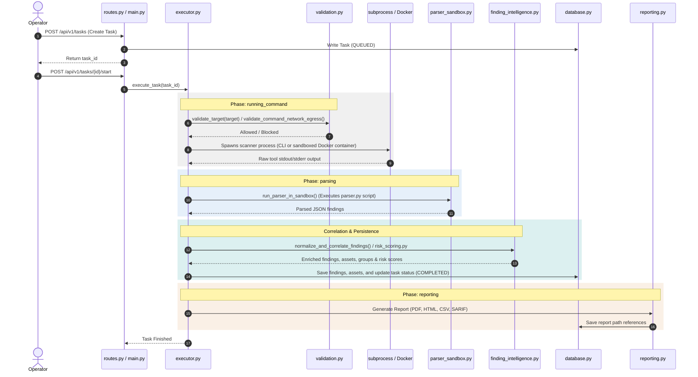

# Backend Architecture

## Overview
SecuScan is a local-first pentesting and vulnerability scanning toolkit. The backend is built on FastAPI, providing a modular framework for running security scans, managing target network permissions, parsing tool outputs, and generating reports. This document outlines the module architecture, standard execution pipelines, and core extension points for contributors.

---

## Module Map

| Path / Module | Responsibility |
|---|---|
| [`main.py`](../backend/secuscan/main.py) | Application entry point: bootstraps FastAPI, lifespan hooks, and mounts middleware/routers. |
| [`routes.py`](../backend/secuscan/routes.py) | Primary REST API layer implementing all standard scanner, task, finding, and reporting endpoints. |
| [`saved_views.py`](../backend/secuscan/saved_views.py) | API router for the analyst saved-views feature, mounted separately in `main.py`. |
| [`config.py`](../backend/secuscan/config.py) | Configuration settings class (`Settings`) loaded from environment variables using Pydantic. |
| [`database.py`](../backend/secuscan/database.py) | Async SQLite wrapper (`aiosqlite`) that manages schema creation, migrations, and database operations. |
| [`migrations/`](../backend/secuscan/migrations) | Numbered SQL migration files applied sequentially at database initialization. |
| [`plugins.py`](../backend/secuscan/plugins.py) | Plugin loader (`PluginManager`) handling metadata validation, checksums, and signature checks. |
| [`plugin_validator.py`](../backend/secuscan/plugin_validator.py) | Standalone validator for plugin directories, shared with CLI helper validation scripts. |
| [`models.py`](../backend/secuscan/models.py) | Canonical Pydantic schemas representing request payloads, response templates, and data entities. |
| [`executor.py`](../backend/secuscan/executor.py) | Core task execution engine orchestrating execution environments, sandboxing, and phase changes. |
| [`execution_context.py`](../backend/secuscan/execution_context.py) | Normalizes and defines the `ExecutionContext` model and validation mode rules. |
| [`parser_sandbox.py`](../backend/secuscan/parser_sandbox.py) | Subprocess wrapper running third-party plugin parsers in a sandbox to isolate crashes. |
| [`capabilities.py`](../backend/secuscan/capabilities.py) | Validates and enforces capability lists (e.g. `local_network`, `raw_socket`) for plugins. |
| [`ratelimit.py`](../backend/secuscan/ratelimit.py) | Controls concurrent task runs and enforces API endpoint rate limits. |
| [`scanners/`](../backend/secuscan/scanners) | Folder holding built-in Python-native scanner implementations subclassing `BaseScanner`. |
| [`validation.py`](../backend/secuscan/validation.py) | Guardrails validating target IPs, URLs, hostnames, ports, and command arguments. |
| [`network_policy.py`](../backend/secuscan/network_policy.py) | Admin-configurable egress engine determining permitted destination networks and IPs. |
| [`redaction.py`](../backend/secuscan/redaction.py) | Utility removing sensitive API keys, credentials, and PII from scan output prior to storage. |
| [`auth.py`](../backend/secuscan/auth.py) | Middleware-free API-key generation, verification, and file-based token configuration. |
| [`vault.py`](../backend/secuscan/vault.py) | Handles symmetric credential encryption for credentials stored inside the database. |
| [`finding_intelligence.py`](../backend/secuscan/finding_intelligence.py) | Normalizes, deduplicates, correlates findings, groups alerts, and determines assets. |
| [`risk_scoring.py`](../backend/secuscan/risk_scoring.py) | Algorithm computing finding priority scores based on severity, CVSS, and asset exposure. |
| [`knowledgebase.py`](../backend/secuscan/knowledgebase.py) | Loads static reference data for vulnerability mappings and descriptions from disk. |
| [`reporting.py`](../backend/secuscan/reporting.py) | Exporters rendering findings into HTML, PDF (xhtml2pdf), CSV, or SARIF documents. |
| [`workflows.py`](../backend/secuscan/workflows.py) | Periodically queries database for scheduled automation workflows and triggers tasks. |
| [`platform_resources.py`](../backend/secuscan/platform_resources.py) | Retrieves target, session, and credential profiles and serializes scan variables. |
| [`crawler.py`](../backend/secuscan/crawler.py) | Provides authenticated web crawling and parsing tools for web-oriented scans. |
| [`cache.py`](../backend/secuscan/cache.py) | High-performance cache wrapper abstracting in-memory or Redis key-value caching. |
| [`notification_service.py`](../backend/secuscan/notification_service.py) | Dispatches post-task events to third-party webhooks or email channels. |
| [`logging_utils.py`](../backend/secuscan/logging_utils.py) | Logging formatters generating structured, machine-parseable JSON log messages. |
| [`request_context.py`](../backend/secuscan/request_context.py) | ContextVar wrappers maintaining the current request's unique identifier (UUID). |
| [`request_middleware.py`](../backend/secuscan/request_middleware.py) | ASGI middleware assigning and injecting a unique request ID into response headers. |
| [`cli.py`](../backend/secuscan/cli.py) | Command-line interface allowing users to run scans directly from their terminals. |
| [`__init__.py`](../backend/secuscan/__init__.py) | Package initialization file indicating a Python package structure. |

---

## Scan Execution Flow

The sequence diagram below traces how a target scanning request is processed end-to-end:

---

## Layer-by-Layer Reference

### Application Bootstrap (`main.py`)
`main.py` is the application entry point. It creates the FastAPI application instance, configures global structured logging, and registers CORS configuration alongside the custom `RequestIDMiddleware`. The database (`init_db`), global cache (`init_cache`), plugins (`init_plugins`), and Docker network configurations are initialized within an `@asynccontextmanager` lifecycle hook. Finally, it registers API routes and exposes the `main()` uvicorn entry point.

### Configuration (`config.py`)
`config.py` manages configuration options through a Pydantic-powered `Settings` class that maps environment variables with the `SECUSCAN_` prefix. Key configuration keys include file directory paths, database settings, Docker security properties, safe-mode targets, CORS policies, rate limits, and cryptographic keys. Contributors altering runtime properties must register settings within the `Settings` class definition in `config.py` rather than hardcoding credentials or configurations inside modules.

### API Layer (`routes.py`, `saved_views.py`)
`routes.py` manages the primary REST API endpoints of the system. It groups endpoints under `/api/v1` for tasks, findings, plugins, reports, workflows, and policies, importing models from `models.py` for payload validation.
`saved_views.py` contains endpoints specifically for saving filter criteria and results, keeping the primary API route codebase isolated.
> [!IMPORTANT]
> `routes.py` is a single file layer containing the entire standard API endpoints surface (~93 KB). Keep new endpoint definitions here, and do not create nested route directories unless major refactorings are approved.

### Data Layer (`database.py`, `migrations/`)
`database.py` defines the async database interface leveraging SQLite via `aiosqlite`. It contains helper wrappers `fetchall`, `fetchone`, and `execute`, alongside database connection and auditing triggers. Schema structure and versions are handled under `backend/secuscan/migrations` as incremental, numbered SQL scripts applied sequentially at database initialization. Contributors changing DB queries or schemas must write a new SQL migration file inside the folder and let the app boot apply it.

### Plugin System (`plugins.py`, `plugin_validator.py`)
`plugins.py` defines the `PluginManager` that handles loading third-party integration descriptors (`metadata.json`) from individual directories. It enforces integrity checks, comparing SHA-256 checksums and digital signatures to verify that files have not been modified post-startup.
`plugin_validator.py` executes standalone validation rules verifying that plugin configurations contain the required properties, field schema structures, and valid engines.

### Task Execution Engine (`executor.py`, `execution_context.py`, `parser_sandbox.py`, `capabilities.py`, `ratelimit.py`)
`executor.py` coordinates task execution state and triggers scans according to target configuration. It enforces safe target constraints, applies sandboxed Docker memory/CPU quotas, streams scan stdout, and invokes `parser_sandbox.py` to parse results safely.
`parser_sandbox.py` isolates third-party parsing scripts inside separate Python subprocesses to isolate parsing crashes.
`capabilities.py` tracks plugin capabilities like `local_network` or `raw_socket`, rejecting scans that request unauthorized capabilities.
`ratelimit.py` provides rate-limiting rules and restricts the number of concurrent scans based on configuration.
> [!IMPORTANT]
> `executor.py` handles the entire core task execution pipeline (~73 KB). Avoid adding cross-cutting feature logic directly inside `executor.py`; instead, write a helper module and import it.
> [!WARNING]
> Do not bypass the subprocess isolation in `parser_sandbox.py` for performance tuning; it is crucial to protect the engine against malicious or crashing parsers.

### Native Scanners (`scanners/`)
Built-in scanners reside inside the `scanners/` subdirectory and subclass `BaseScanner` (`scanners/base.py`). Each built-in scanner orchestrates local binary scans (e.g. nmap, zap, or nuclei) to capture outputs directly through custom subprocess flows.
The classes (e.g. `WebScanner`, `PortScanner`, `APIScanner`) utilize the `_execute_command` interface which performs egress checking on command parameters at execution boundaries.

### Validation & Security (`validation.py`, `network_policy.py`, `redaction.py`, `auth.py`, `vault.py`)
This security layer validates inputs, checks permissions, and guards data.
`validation.py` enforces target hostnames, loopbacks, DNS rebind checks, and command parameters formats.
`network_policy.py` matches targets against allowed/denied CIDR ranges and networks.
`redaction.py` masks credit cards, private keys, and API tokens within reports.
`auth.py` handles authentication keys, while `vault.py` encrypts DB credentials symmetrically using the vault key.

### Findings Intelligence & Risk (`finding_intelligence.py`, `risk_scoring.py`, `knowledgebase.py`)
`finding_intelligence.py` correlates findings and builds a unified view of asset vulnerabilities.
`risk_scoring.py` computes CVSS/asset risk scores dynamically.
`knowledgebase.py` maps findings against vulnerability reference information on disk.

### Reporting (`reporting.py`)
`reporting.py` manages report rendering, taking tasks results and outputting PDF documents, static HTML formats, spreadsheet CSV formats, or standard SARIF output.

### Workflow Automation (`workflows.py`)
The workflow engine handles the execution of automated, recurring scan sequences. It coordinates the lifecycle of complex scans from scheduling through task queue handoffs via the `WorkflowScheduler` class.

#### 1. Persistence
Workflow execution configurations, schedules, and histories are stored in and retrieved from the central SQLite database managed by `database.py`.
* **State Management:** The system reads configurations (`schedule_seconds`, `steps_json`) directly from the `workflows` table.
* **Reliability:** Immediately after a workflow run sequence successfully initializes its underlying steps, the scheduler updates persistence state records by issuing an `UPDATE workflows SET last_run_at = datetime('now')` command.

#### 2. Scheduling & Execution Engine
The `WorkflowScheduler` runs an asynchronous background loop (`_run_loop()`) acting as a continuous evaluation engine.
* **The Loop:** The scheduler triggers a `tick()` evaluation sequence continuously on a configured clock interval using `await asyncio.sleep(5)`.
* **Evaluation Boundary:** During each tick, the scheduler queries active workflows and passes their last execution timestamps into `_should_run()`. If the calculated elapsed delta exceeds the target threshold, the sequence moves into the `_run_workflow()` coordinator.

#### 3. Queue Interaction & Task Handoff
Once a workflow is triggered, its individual steps are verified and dynamically scheduled without blocking the core loop.
* **Validation Guards:** Individual steps undergo target validation via `validate_target()`, network policy matching via `get_policy_engine()`, and rate-limiting validation via the `workflow_rate_limiter` and `rate_limiter` wrappers.
* **Asynchronous Handoff:** Once cleared, a task tracking ID is generated through `await executor.create_task()`. Rather than blocking the main scheduler timeline, the task execution sequence is handed off safely to the background event loop via `asyncio.create_task(run_task(task_id))`.

> [!WARNING]
> The `WorkflowScheduler` ticks continuously every 5 seconds without utilizing a task queue. If the steps of a workflow take longer than its configured `schedule_seconds`, the scheduler will trigger a duplicate execution in the next tick. Contributors modifying this scheduler should account for this behavior.

### Infrastructure Utilities
Utilities manage caching (`cache.py`), system logging formats (`logging_utils.py`), tracking request IDs (`request_context.py`, `request_middleware.py`), Typer-based command lines (`cli.py`), and notification rule processing (`notification_service.py`).

---

## Key Data Models

### Scan Execution Lifecycle
The execution state is controlled by two distinct fields in the database `tasks` table:
1. **`TaskStatus`** (defines global state): `queued` -> `running` -> `completed` / `failed` / `cancelled`.
2. **`ScanPhase`** (defines granular execution step): `queued` -> `running_command` -> `parsing` -> `reporting` -> `finished`.

### Finding Properties
`Finding` fields normalize security scanner outputs inside the database:
- `id` / `finding_group_id` / `asset_id`: unique identifiers mapping details.
- `title` / `description` / `remediation`: text descriptions.
- `severity` / `risk_score` / `risk_factors`: severity evaluation.
- `proof` / `evidence`: output and validation artifacts.
- `cvss` / `cve` / `cpe`: industry vulnerability metrics.

### ExecutionContext
Configures policy constraints for scans:
- `target_policy_id`: links scanning options.
- `scan_profile`: scan speed/depth.
- `validation_mode`: how far verification proceeds (`detect_only`, `proof`, `controlled_extract`).
- `evidence_level`: severity evidence retention levels (`minimal`, `standard`, `full`).

---

## Extension Points

### 1. Adding a New Native Scanner
Native scanners are Python classes that implement scan logic directly:
1. Subclass `BaseScanner` inside `backend/secuscan/scanners/` (e.g. `my_scanner.py`).
2. Implement required properties `name`, `category`, and async method `run(target, inputs)`.
3. Call `_execute_command(command)` for CLI tools to ensure network egress checks run.
4. Import and register your scanner in the `MODULAR_SCANNERS` mapping in `backend/secuscan/executor.py`.

### 2. Adding a New Third-Party Plugin
Plugins integrate third-party tools via descriptors:
1. Create a subdirectory under the repository root `plugins/` (e.g. `plugins/my_tool/`).
2. Write a `metadata.json` containing metadata, input fields, and output structures.
3. Write a custom `parser.py` parsing the output to a JSON array of `Finding` models.
4. Run `python scripts/refresh_plugin_checksum.py --plugin <plugin_id>` to generate/verify checksums.

### 3. Adding a New API Route
To extend REST paths:
1. Define a request/response Pydantic schema in `backend/secuscan/models.py`.
2. Add an endpoint method in `backend/secuscan/routes.py` with the appropriate path.
3. Fetch connections asynchronously via `get_db()` or trigger tasks via `executor.execute_task()`.

---

## Related Docs
* [Contributor Guide](../CONTRIBUTING.md) — Dev environment setup and tests layout.
* [API Specification](API.md) — API endpoints schema layout.
* [Plugin Testing and Validation](plugin-validation.md) — Signature validation and metadata schema instructions.
* [Plugin Contribution Guide](../PLUGINS.md) — Writing parsers and plugin lifecycle specifications.
